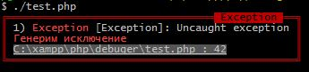

Debuger
=======

The error handler and dump variables.

## Installation

Download repository:

    git clone https://github.com/Professionali/debuger.git

Registr in `php.ini`:

    auto_prepend_file = "<path_to_debuger>\debuger\debuger.php"

## Using

Show variable dump:

    p($my_var);

### In Web mode

### In CLI mode

